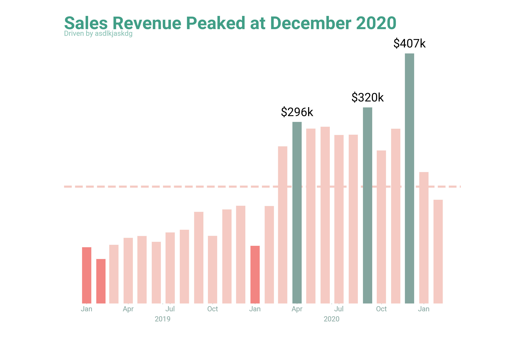
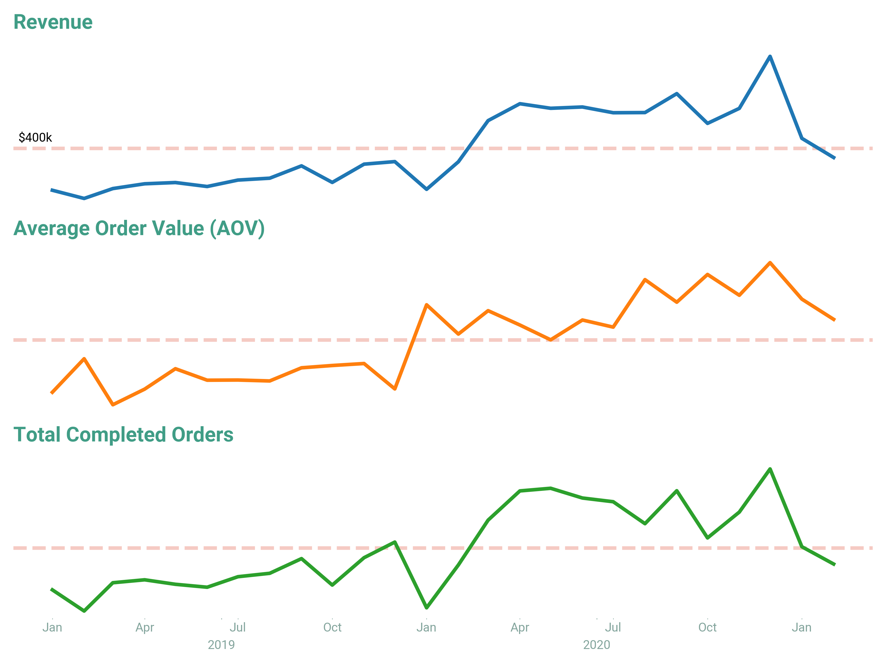
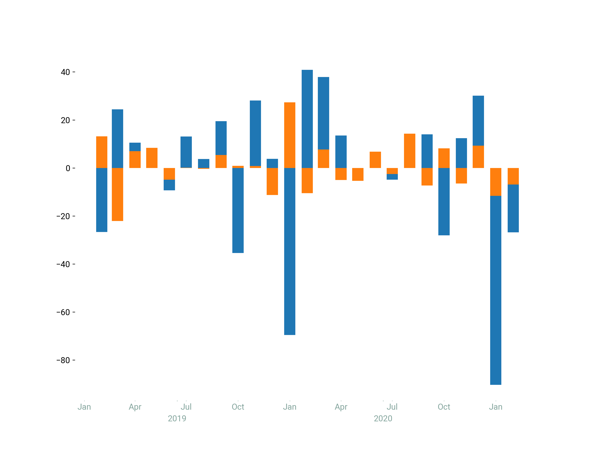
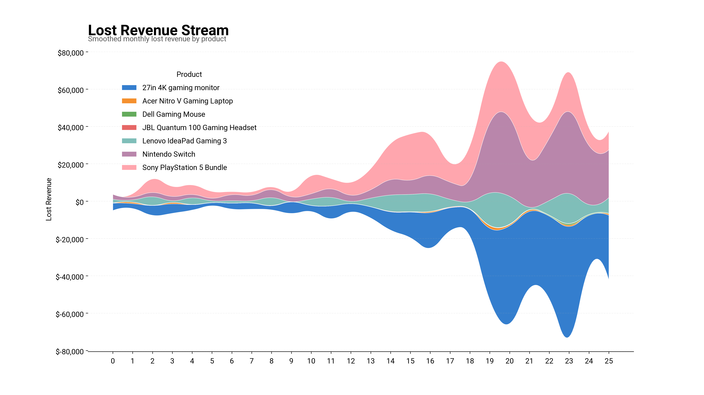
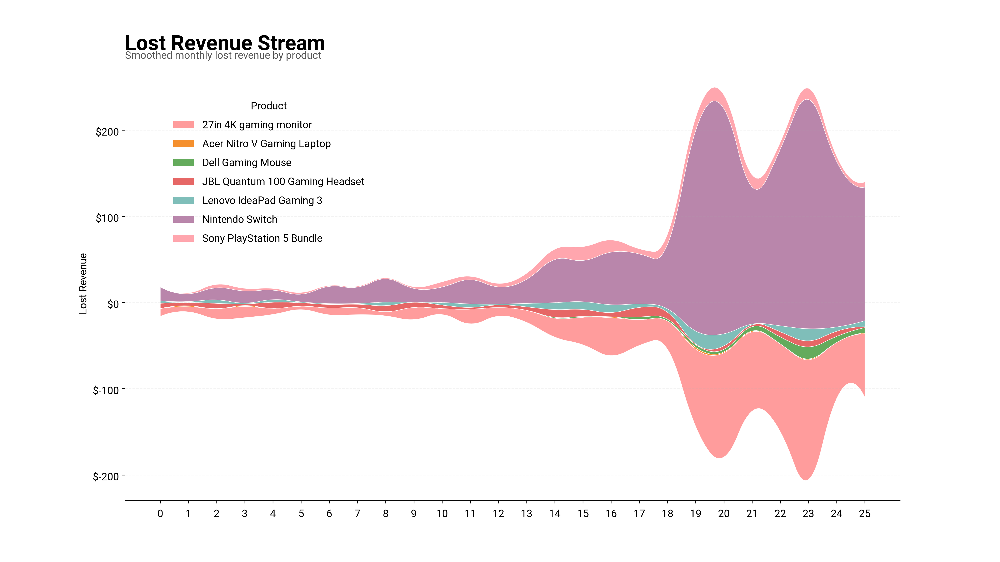

<p align="center">
  
</p>

# <p align="center">Client Background</p>


The Game Zone is an international Video Game Store specializing in new and pre-owned games, systems, and accessories from ALL generations throught the history of gaming. Apart from generation systems, The Game Zone also showcases a massive collection of retro games and consoles inculding many rare and hard-to-find titles.

The Game Zone's book of business is approaching N customers and possesses over N transactions, generating gross revenue somewhere $N million. The available eCommerce data spans various dimensions and metrics, including sales, products, marketing channels, and sales by regions.

Reporting to the Head of Sales and Operations, an in-depth analysis was conducted to evaluate The Game Zone's perfomance over the past several years(insert date). This comprehensize review provides valuable insights that internal cross-functional teams will utilize to streamline process and enhance The Game Zone's commercial performance. The key insights and recommendations focus on the following areas:


## Northstar Metrics
- [Sales trends](#sales-trends) - focusing on key metrics of sales revenue, number of orders placed, and average order value
- [Product performance](#product-performance)  - Analyzing different product lines, market impact, and refund rates to inform strategic product decisions
- [Platform](#) - 
- [Marketing Channel](#) - 

#

# <p align="center">Executive Summary</p>
<h2 style="border-bottom: none;", align = "center">Write the headline here.</h2>


* Figure 1: Some caption here *

1. Revenue Growth and Peak Performance
- 
2. Declining Trend in 2021

3. Quarterly Insights and Seasonal Trends

4. Key Takeaways and Recommendations
- Investigate the causes of the 2021 decline 
- Leverage high-perfoming periods (Q3 and Q4) to refine marketing
## Dataset Structure and Entity Relationship Diagram(ERD)

dataset desc

row count ...

# <p align="center">Deep-dive Insights</p>
## Sales trends


### <p align="center">Sales Growth follows seasonal fluctuations, while AOV remains relatively constant, except for the Sales Growth in October 2022</p>


## Product performance

## 

## 


<details>
<summary><b>Table of Contents (Click to expand)</b></summary>

* [1. Introduction](#1-introduction)
* [2. Getting Started](#2-getting-started)
  * [2.1 Installation](#21-installation)
  * [2.2 Configuration](#22-configuration)
* [3. Advanced Usage](#3-advanced-usage)

</details>
## 1. Introduction
This is the introduction section.

## Frequently Asked Questions
This is the FAQ section.


<details>
  <summary>Click to expand</summary>
  #asdasdasdas
  Your Markdown content or text goes here.

</details>

<details>
  <summary>View Code Example</summary>

  # This is a Heading
  * Item one
  * Item two

  ```python
  asdasdasd
  ```

</details>

## Entity Relationship Diagram


# <p align="center">Refunds</p>




