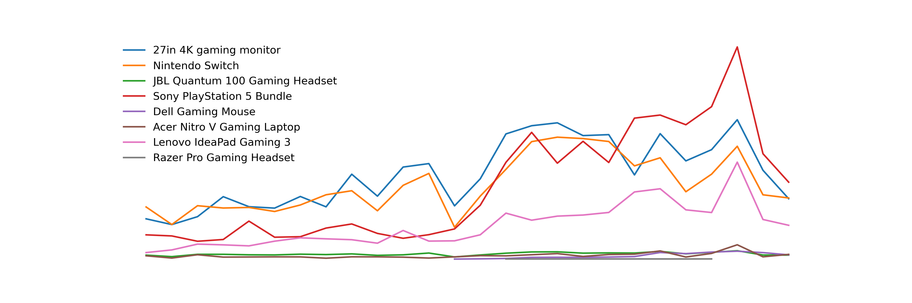
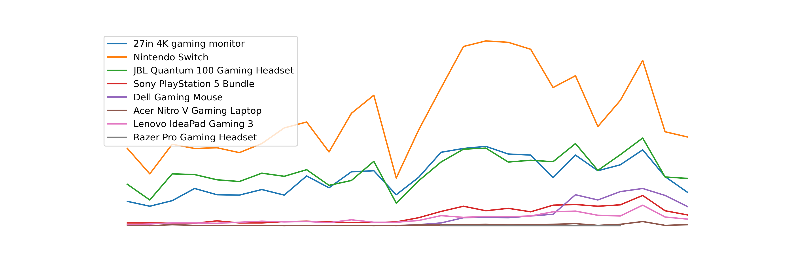

<p align="center">
  
</p>

# <p align="center">Client Background</p>

The Game Zone is an international video game store specializing in new and pre-owned games, systems, and accessories from ALL generations throught the history of gaming. Apart from generation systems such as retro games and consoles that includes hard-to-find titles, The Game Zone also showcases a massive collection of modern-day computer electronics.

The Game Zone's book of business in online consumer electronics is approaching 30,000 customers and possesses over 50,000 transactions, generating gross revenue of near $5 million. The available eCommerce data spans various dimensions and metrics, including sales, products, and marketing channels.

Reporting to the head of Sales and Operations, an in-depth analysis was conducted to evaluate The Game Zone's perfomance from 2019 to early 2021. This comprehensize review provides valuable insights that internal cross-functional teams will utilize to streamline process and enhance The Game Zone's commercial performance. The key insights and recommendations focus on the following areas:


## Northstar Metrics
- [Sales trends](#sales-trends) - focusing on key metrics of sales revenue, number of orders placed, and average order value
- [Product performance](#product-performance)  - Analyzing different product lines, market impact, and refund rates to inform strategic product decisions
- [Platform](#) - 
- [Marketing Channel](#) - 

#

<table align="center">
  <tr>
    <div width="920">
      <h1 align="center">Executive Summary</h1>
      <div align="center">
        
      </div>
      <td width="460" valign="top">
        <ol>
          <li>
            <strong>Revenue Growth and Peak Performance:</strong>
            <ul>
              <li>2020 was the strongest year, with sales growing each quarter as a result of the higher order frequency.</li>
              <li>Q4 2020 saw the highest revenue $400k in December 2020, making it the best-performing month.</li>
              <li>April 2020 ($300k) and September 2020 ($320k) also maintained strong sales, though a minor downward trend started afterward.</li>
            </ul>
          </li>
          <li>
            <strong>Declining Trend in Q1 2020</strong>
            <ul>
              <li> A sales anomaly and a significant downward trend occurred in January 2020 ($94k), due to the extreme lack of transactions at first two-thirds of the month.</li>
              <li>The Q1 revenue decline suggests a major downturn, likely caused by external market conditions, reduced consumer demand, or internal operational shifts.</li>
            </ul>
          </li>
        </ol>
      </td>
      <td width="460" valign="top">
        <ol start="3">
          <li>
            <strong>Quarterly Insights & Seasonal Trends</strong>
            <ul>
              <li>Q3 and Q4 of each year typically show strong performance, likely due to seasonal shopping trends and marketing efforts.</li>
              <li>Revenue quickly dropped every Q1, signaling an overall weak performance compared to the other quarters.</li>
            </ul>
          </li>
          <li>
            <strong>Key Takeaways & Recommendations</strong>
            <ul>
              <li>Investigate the causes of the January 2020 which causes the decline (e.g., market changes, competition, internal factors).</li>
              <li>Leverage high-performing periods (e.g., December 2020 and Septermber 2020) to refine marketing and sales strategies.</li>
              <li>Reassess business strategy for the upcoming year, focusing on promotions, pricing, and customer engagement to regain momentum.</li>
            </ul>
          </li>
        </ol>
      </td>
    </div>
  </tr>
</table>


## Dataset Structure and Entity Relationship Diagram(ERD)

dataset desc

row count ...

# <p align="center">Deep-dive Insights</p>
## Sales trends


### <p align="center">show fluctuations</p>


## Product performance




## 

## 


<details>
<summary><b>Table of Contents (Click to expand)</b></summary>

* [1. Introduction](#1-introduction)
* [2. Getting Started](#2-getting-started)
  * [2.1 Installation](#21-installation)
  * [2.2 Configuration](#22-configuration)
* [3. Advanced Usage](#3-advanced-usage)

</details>
## 1. Introduction
This is the introduction section.

## Frequently Asked Questions
This is the FAQ section.


<details>
  <summary>Click to expand</summary>
  #asdasdasdas
  Your Markdown content or text goes here.

</details>

## Entity Relationship Diagram


# <p align="center">Refunds</p>


# <p align="center">Recommendations</p>

# <p align="center">Appendix</p>

<details>
  <summary>Python Visualization</summary>

  # This is a Heading
  * Item one
  * Item two

  ```python
  asdasdasd
  ```

</details>